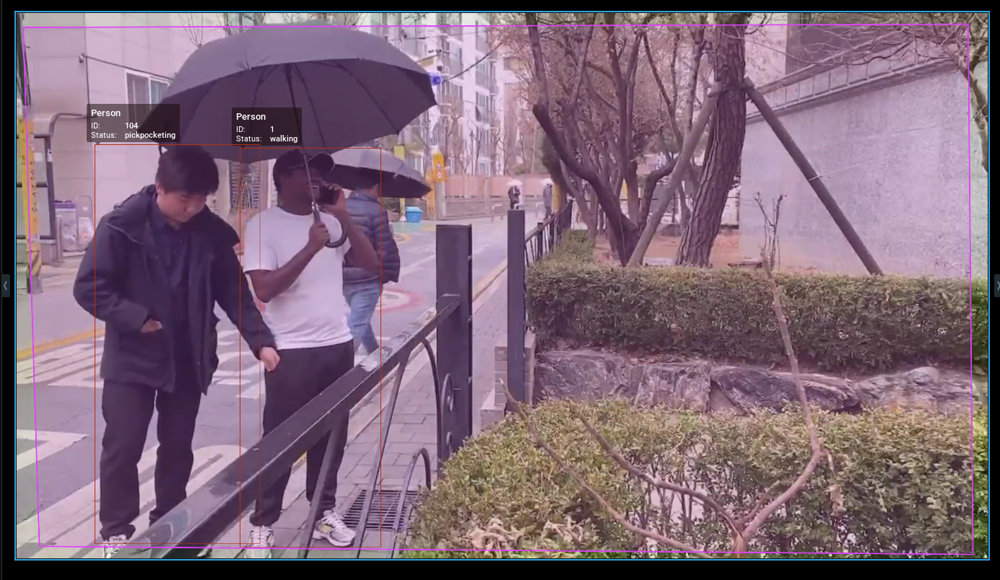

<div align="center">
  <h1><span style="color:red">*** **VisionZero Team** ***</span></h1>
  <p><a href="https://lycaoduong.github.io/">Cao Duong Ly</a>, <a href="https://github.com/LuciusMagnus">LuciusMagnus</a></p>
  <p> NX Witness Hackathon 2025 </p>
  <p>
  
  
  
  
  
  
</p>
</div>


## <span style="color:red">Prerequisites</span>

Ensure you have the following libraries and tools installed before proceeding:

### *** **For Building Plugin** ***
1. **Visual Studio 2019**  
    - Download and install Visual Studio 2019: [Visual Studio 2019](https://1drv.ms/f/c/ce0612f2b3535b28/En3xt3I7cZxNp-pGv2M-3l8BMJM2in2n2JlEV4K_ROYozA?e=P806eL).

2. **VSCode + CMake**
    - Install Visual Studio Code (VSCode) from: [Visual Studio Code.](https://code.visualstudio.com/)
    - Install Cmake: [CMake.](https://cmake.org/download/)
    - CMake and CMake Tools extension for VSCode are required for building and managing CMake projects.
    - Install the CMake extension for VSCode from the Extensions marketplace.

3. **CUDA 11.8**
    - Download and install CUDA 11.8 for Windows: [CUDA 11.8](https://1drv.ms/f/c/ce0612f2b3535b28/EqqEpI3_XxdLm47FPppand4Bk5Nvrm904fxYWMkUa6hJyg?e=8BxINr).

4. **CuDNN + TensorRT**
    - Download CuDNN for CUDA 11.8: [CuDNN + TensorRT](https://1drv.ms/f/c/ce0612f2b3535b28/EirzojYzIwFKp0eOh47gT50BFk6Q5O7wdAvzX-BP8auiKw?e=XdUTaK).
    - Once you've downloaded CuDNN, extract the contents and copy the following folders to the CUDA installation directory:
      ```
      lib → C:\Program Files\NVIDIA GPU Computing Toolkit\CUDA\v11.8\lib\x64
      bin → C:\Program Files\NVIDIA GPU Computing Toolkit\CUDA\v11.8\bin
      include → C:\Program Files\NVIDIA GPU Computing Toolkit\CUDA\v11.8\include
    - If you're using TensorRT, follow the same steps as for CuDNN, but please note that we only tested with CuDNN.

### *** **For Testing Plugin** ***
1. **NX Server and NX Client for Windows**
     - Download and install NX Server and NX Client for Windows: [NX Server and NX Client.](https://1drv.ms/f/c/ce0612f2b3535b28/Ep2j4zZaO61Hra4qaP9SDZwBrpB_VlnTYWAxLig-vXju4w?e=XwXKX5)

2. **VisionZero Team Plugin**
    - Download VisionZero Team Plugin from: [nx_plugin_clip.](https://1drv.ms/f/c/ce0612f2b3535b28/EjF5LLAzTQ1FvtBe-m6pmpwB6LVqDgOTXpeDC7h600lzyw?e=Ql4RXh)
    - Paste the `nx_plugin_clip` folder into the plugins folder (After install NX Server)
      ```
      C:\Program Files\Network Optix\Nx Witness\MediaServer\plugins
3. **Docker Desktop**
    - Install Docker Desktop from: [Docker Desktop.](https://www.docker.com/get-started/)
    - Follow the installation instructions on the page to set up Docker on your system.

4. **CLIP-Textual Server**
    - Download CLIP-Textual Server from: [CLIP-Textual Server.](https://1drv.ms/f/c/ce0612f2b3535b28/EpRWOD70I9RLn8E2rJaIMBIBkwYtviq-Nb7_K6yu3_gTVg?e=AtHDal)

5. **HTTP SnapShot Server**
    - Download and run an HTTP SnapShot Server from: [FTP Server.](https://1drv.ms/f/c/ce0612f2b3535b28/Er4SKk13YCNCtq9c7mOnG0sBrfUSR-kg8epz51G6Gai44Q?e=vjKBHS)

6. **MariaDB + SearchApp**
    - Download docker-compose.yml from: [MariaDB + SearchApp.](https://1drv.ms/f/c/ce0612f2b3535b28/EjbrYDvg07FCi_RH0USOLycBvRacaGrFsA11O7p67nKXAA?e=W71VQH)

7. **HuggingFace lycaoduong/InternVL2-1B-NXDemo Space access token**
    - To gain access to the HuggingFace space for InternVL2-1B-NXDemo, contact via email to get the access token: hf_<your token here> at lycaoduong@gmail.com.
8. Download and Test NxTestcamera with Videos
    - Download NxTestcamera and the testing videos: [NxTestcamera and Testing Videos](https://1drv.ms/f/c/ce0612f2b3535b28/EkYyy5y5UJBBsujED59MvZ0BQVxXhV1BBFpAOPm1ElJfpQ?e=cAZUh0)
    - Use NxTestcamera to stream videos to the RTSP camera following the NX Witness Guidelines.

## <span style="color:red">Installation and Build Steps</span>

### Step 1: Download and Prepare Dependencies
  - Download all dependencies from: [Dependencies](https://1drv.ms/f/c/ce0612f2b3535b28/EvhSMjMTzHNNlHssqj_R4HUBZf5iFn86Xin-3pvjNTNYmg?e=ytwwUu)
  - Place 'lib' Folder (includes `curl-7.86.0`, `eigen`, `mysql-8.0.32`, `onnxruntime`, `opencv`, `rapidjson`, and `spdlog-1.x`) into the $(SolutionDir).
  - Place 'nx_kit' and 'nx_sdk' folders into the $(SolutionDir).
  - Place latest VisionZero's Core (LVisLib.lib) and place them into the $(SolutionDir)core\LVisLib\lib folder.

### Step 2: Set Up the CMake Configuration
  - Open the folder $(SolutionDir) in VS Code.

### Step 3: Configure the Build Kit
  - Press Ctrl + Shift + P and search for CMake: Select a Kit.
  - Choose Visual Studio 2019 (ensure that you select the x64 variant).

### Step 4: Configure and Build Using CMake
  - Press Ctrl + Shift + P, search for CMake: Configure, and select it to configure the build.
  - Press Ctrl + Shift + P, search for CMake: Select Build Variant, and select Release.
  - After configuration is complete, press Ctrl + Shift + P again and search for CMake: Build
  - Alternatively, you can run the build manually from the terminal by using the following command:
    ```
    cmake --build build --config Release
### Step 5: Deploy the Plugin
  - Copy the generated `nx_plugin_clip.dll` file from the build output directory:
    ```
    $(SolutionDir)\build\Release\
### Step 6: Deploy the Plugin
  - Paste the `nx_plugin_clip.dll` file into the NX Plugin Server folder
    ```
    C:\Program Files\Network Optix\Nx Witness\MediaServer\plugins\nx_plugin_clip
  - Note: Stop the NX Server before overwriting the existing plugin file.

## <span style="color:red">*** Testing Steps ***</span>

### Step 1: Configure Database Server IP, CLIP-Textual Server IP, Hugging Face Access Token, and Forward HTTP Snapshot Server
  - Open the nx_plugin_clip.ini configuration file.
  - The nx_plugin_clip.ini file is located in the plugin directory:
    ```
    C:\Program Files\Network Optix\Nx Witness\MediaServer\plugins\nx_plugin_clip
  - Check your Server IP using the following command:
    ``` bash
    ipconfig
  - Set the Database Server IP in nx_plugin_clip.ini to match your Server IP.
  - Set the CLIP-Textual Server IP in nx_plugin_clip.ini to match your Server IP.
  - Configure the Hugging Face access token in nx_plugin_clip.ini.
  - Forward the HTTP Image Storage Server port and set your public IP address to allow Hugging Face Space to access stored data.

  <div align="center">
    
  </div>
    
### Step 2: Run CLIP-Textual Server
  - Start the CLIP-Textual Server.
  <div align="left">
    
  </div>

### Step 3: Run HTTP Storage Image Server
  <div align="left">
    
  </div>

### Step 4: Run MariaDB Server and Search App
  - Navigate to the directory containing docker-compose.yml and start the container:
    ``` bash
    docker compose up -d
    ```
  <div align="left">
    
  </div>

### Step 5: Check DB Status
- Open the search app container logs from Docker Desktop to confirm the database status. If the database is not running, restart the search app container.
<div align="left">
  
</div>

### Step 6: Start Server, set ROI and Enable Plugin
<div align="left">
  
</div>

### Step 7: Add Actions to detect
<div align="left">
  
</div>

### Step 8: Attempt a query search within the search application located at http://localhost:7860.
<div align="left">
  
</div>

### Step 9: Verify the snapshot images from the {HTTP Image Storage Server Dir}/CameraName/data directory.
<div align="left">
  
</div>

### Step 10: Verify the image description result generated by the Vision Language Model (VLM) from the database.
<div align="left">
  
</div>

## <span style="color:red">Demonstration Video and Supplementary</span>

### Demonstration Video + Presentation
  <!-- [](https://youtu.be/NiLgZeHn2_Y) -->
  - View the presentation video here: [YouTube.](https://youtu.be/NiLgZeHn2_Y)
  - Access the presentation PPTX here: [Download.](https://1drv.ms/f/c/ce0612f2b3535b28/EncUQu_jRvVGg_SI4giP0fYBJPQ-KoiUK2x8hp8428su4w?e=d6hAzN)

### Additional Videos
  - Video showcasing system testing (demo and test with speaker and signal tower): [Download.](https://1drv.ms/f/c/ce0612f2b3535b28/ElSEp7k5VptOsGebQLjgDa8BzS8-Yv_qQrdP5zDNZ6XOnw?e=R2ceLb)
  - For system testing, we also utilized the video titled "thief_video3" from Laoode's GitHub repository, available https://github.com/Laoode/Theft_Detection/tree/main/Test%20Videos.

## <span style="color:red">Pretrained Models + Resources</span>

1. **YOLOv8 COCO**  
 - https://docs.ultralytics.com/ko/models/yolov8/

2. **CLIP** 
 - https://github.com/openai/CLIP 

3. **ByTrack**
 - https://github.com/ifzhang/ByteTrack  

4. **InternVL2.5-1B**  
 - https://github.com/OpenGVLab/InternVL

5. **Thief Video**  
 - Laoode, "Thief Video," [GitHub Repository](https://github.com/Laoode/Theft_Detection/tree/main/Test%20Videos)

 ## <span style="color:red">Citations</span>
  ```BibTeX
  @inproceedings{radford2021learning,
  title={Learning transferable visual models from natural language supervision},
  author={Radford, Alec and Kim, Jong Wook and Hallacy, Chris and Ramesh, Aditya and Goh, Gabriel and Agarwal, Sandhini and Sastry, Girish and Askell, Amanda and Mishkin, Pamela and Clark, Jack and others},
  booktitle={International conference on machine learning},
  pages={8748--8763},
  year={2021},
  organization={PmLR}
}
@inproceedings{zhang2022bytetrack,
  title={Bytetrack: Multi-object tracking by associating every detection box},
  author={Zhang, Yifu and Sun, Peize and Jiang, Yi and Yu, Dongdong and Weng, Fucheng and Yuan, Zehuan and Luo, Ping and Liu, Wenyu and Wang, Xinggang},
  booktitle={European conference on computer vision},
  pages={1--21},
  year={2022},
  organization={Springer}
}
 @inproceedings{chen2024internvl,
  title={Internvl: Scaling up vision foundation models and aligning for generic visual-linguistic tasks},
  author={Chen, Zhe and Wu, Jiannan and Wang, Wenhai and Su, Weijie and Chen, Guo and Xing, Sen and Zhong, Muyan and Zhang, Qinglong and Zhu, Xizhou and Lu, Lewei and others},
  booktitle={Proceedings of the IEEE/CVF Conference on Computer Vision and Pattern Recognition},
  pages={24185--24198},
  year={2024}
}
@misc{doan2024vintern1befficientmultimodallarge,
      title={Vintern-1B: An Efficient Multimodal Large Language Model for Vietnamese}, 
      author={Khang T. Doan and Bao G. Huynh and Dung T. Hoang and Thuc D. Pham and Nhat H. Pham and Quan T. M. Nguyen and Bang Q. Vo and Suong N. Hoang},
      year={2024},
      eprint={2408.12480},
      archivePrefix={arXiv},
      primaryClass={cs.LG},
      url={https://arxiv.org/abs/2408.12480}, 
}
```